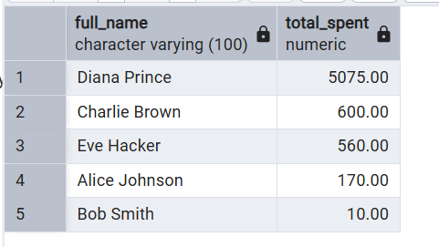
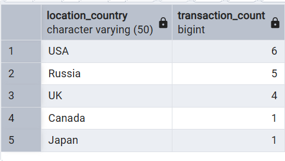
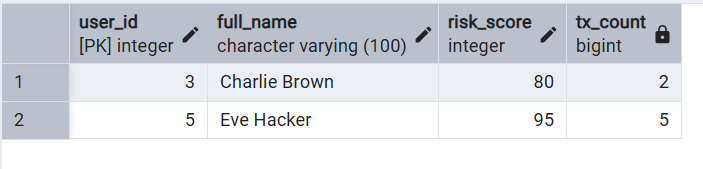
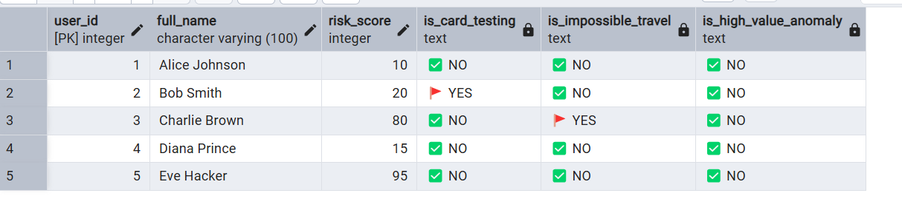

# 💳 Financial Fraud Detection Analysis (SQL)

## 📌 Project Overview
This project focuses on analyzing transaction data to identify patterns indicative of fraudulent activity. By leveraging advanced SQL techniques such as **Window Functions**, **CTEs**, and **Case Logic**, the project flags suspicious transactions based on real-world fraud indicators.

## 🚀 Fraud Indicators Tracked
1. **Rapid-Fire Failed Payments:** Identifying users with multiple failed transactions in a short window (Potential brute-force or card testing).
2. **Impossible Travel (Velocity Check):** Flagging transactions occurring in different cities within a timeframe that makes physical travel impossible.
3. **High-Value Anomalies:** Identifying transactions that are significantly higher (e.g., 3x) than the user's average spending habit.
4. **Rapid Transaction Spikes:** Detecting a sudden burst of high-frequency transactions in a very short period.

## 🛠️ Tech Stack
- **Language:** SQL (PostgreSQL / MySQL compatible)
- **Key Concepts:** 
    - `WINDOW FUNCTIONS` (LAG, LEAD, AVG OVER)
    - `CTEs` (Common Table Expressions)
    - `DATE_DIFF` & Time Manipulation
    - `JOINs` & `Aggregations`

## 📂 Folder Structure
- `schema.sql`: Database structure and table definitions.
- `seed_data.sql`: Mock data to simulate fraudulent and legitimate behavior.
- `data_dictionary.md`: Detailed explanation of every column and table.
- `queries/`: 
    - `01_exploration.sql`: Initial data sanity checks and summaries.
    - `02_analysis.sql`: Mid-level analysis of transaction trends.
    - `03_advanced_queries.sql`: The "Fraud Engine" (Complex detection queries).

## ⚙️ How to Run
1. Run `schema.sql` to create the tables.
2. Run `seed_data.sql` to populate the database.
3. Execute the queries in the `queries/` folder sequentially.

# Screenshots

1. Top 5 User's with the highest total spending

2. Distribution of transactions across countries

3. Check for users with high internal risk scores and their transaction counts

4. 03_ADVANCED_QUERIES: The Fraud Detection Engine
-- Using CTEs, Window Functions, and Time-based analysis

-- 🚩 DETECTOR 1: Rapid-Fire Failed Payments (Card Testing)
-- Flag users who have 3+ failed payments within a 10-minute window

-- 🚩 DETECTOR 2: Impossible Travel (Velocity Check)
-- Flag transactions where a user transacts in two different cities 
-- in a timeframe too short for physical travel (e.g., < 5 hours)

-- 🚩 DETECTOR 3: High-Value Anomalies (Z-Score / Multiplier Logic)
-- Flag transactions that are 3x greater than the user's historical average spending

-- 🚩 DETECTOR 4: Rapid Transaction Spikes (Burst Detection)
-- Flag users who make more than 4 transactions in under 5 minutes

-- 🚀 FINAL SUMMARY: Comprehensive Fraud Alert Table
